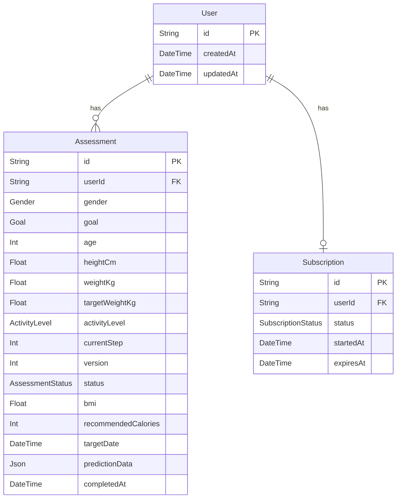

# Health Assessment

A full-stack health assessment application built for the Arkon Tech Full-Stack Development Challenge.

Users complete a multi-step health questionnaire, with progress persisted after each step. The server calculates a wellness assessment, provides a limited free result, and unlocks the complete result after a mock subscription payment.

## Live Demo

https://health-assessment-rust.vercel.app

A pre-paid test session is available for verification:

```text
sessionId: cmugtkqnl000004i5ped0t2k2
```

Full result endpoint:

```text
https://health-assessment-rust.vercel.app/api/results/cmugtkqnl000004i5ped0t2k2
```

## Tech Stack

- Next.js 16 (App Router)
- TypeScript
- React
- Tailwind CSS
- Prisma ORM
- PostgreSQL / Supabase
- Zod
- Vitest
- Vercel

The frontend and backend are implemented in a single Next.js repository. Backend endpoints are implemented with App Router Route Handlers.

## Main Flow

1. A new session is created with a random session ID.
2. The user completes four assessment steps:
   - gender
   - health goal
   - age, height, current weight, and target weight
   - activity level
3. Each step is persisted immediately.
4. `currentStep` allows an interrupted assessment to be restored.
5. `version` provides optimistic concurrency control.
6. The completed assessment is calculated and persisted on the server.
7. Free users receive only the non-protected result.
8. A mock payment changes the subscription status to `ACTIVE`.
9. Active subscribers can retrieve the complete assessment.

## Local Setup

Install dependencies:

```bash
npm install
```

Create a `.env` file:

```env
DATABASE_URL="postgresql://..."
```

Generate the Prisma client:

```bash
npx prisma generate
```

Run the development server:

```bash
npm run dev
```

Open:

```text
http://localhost:3000
```

The database schema is located at:

```text
prisma/schema.prisma
```

## API

### Create Session

```http
POST /api/sessions
```

Creates a user, assessment, and inactive subscription.

Example response:

```json
{
  "sessionId": "...",
  "assessmentId": "...",
  "currentStep": 0,
  "version": 0,
  "subscriptionStatus": "INACTIVE"
}
```

### Save Assessment Step

```http
PATCH /api/assessment/:sessionId
```

Example:

```json
{
  "step": 1,
  "version": 0,
  "data": {
    "gender": "FEMALE"
  }
}
```

The API validates both the step payload and the submitted version.

A stale version returns HTTP `409`, preventing concurrent or repeated stale writes from silently overwriting newer data.

Skipping required steps also returns HTTP `409`.

Previous completed steps may be edited. `currentStep` never moves backwards.

### Restore Assessment

```http
GET /api/assessment/:sessionId
```

Returns the persisted assessment, including `currentStep` and `version`, so an interrupted questionnaire can continue.

### Complete Assessment

```http
POST /api/assessment/:sessionId/complete
```

Validates the complete assessment, calculates the health result on the server, and persists the calculated fields.

### Get Results

```http
GET /api/results/:sessionId
```

For an inactive subscription, only the free result is returned. Protected fields are omitted by the server rather than merely hidden in the UI.

Example free response:

```json
{
  "subscriptionStatus": "INACTIVE",
  "locked": true,
  "result": {
    "bmi": 23.9
  }
}
```

An active subscription additionally receives:

- recommended daily calories
- estimated target date
- weight progress prediction

### Mock Payment

```http
POST /api/pay
```

Request:

```json
{
  "sessionId": "..."
}
```

This is intentionally a mock payment endpoint. No real payment provider or card information is involved.

Replay with curl:

```bash
curl -X POST https://health-assessment-rust.vercel.app/api/pay \
  -H "Content-Type: application/json" \
  -d '{"sessionId":"YOUR_SESSION_ID"}'
```

After payment, retrieve the full result:

```bash
curl https://health-assessment-rust.vercel.app/api/results/YOUR_SESSION_ID
```

## Data Model



Assessment fields are nullable while the questionnaire is in progress because answers are persisted incrementally. Completion performs stricter validation before calculated results are stored.

## Health Calculation

The assessment currently provides demonstration-oriented wellness estimates rather than medical recommendations.

### BMI

```text
BMI = weightKg / heightMeters²
```

### Calorie Estimate

The implementation uses a Mifflin-St Jeor-style BMR calculation and applies an activity multiplier.

Goal adjustments:

- weight loss: -500 kcal/day
- maintenance: no adjustment
- weight gain: +300 kcal/day

A minimum recommendation of 1200 kcal/day is applied.

For the `OTHER` gender option, the demo implementation uses a neutral midpoint adjustment. This is an explicit product simplification rather than a medical assumption.

### Target Date

For weight-change goals, the demonstration model assumes approximately 0.5 kg/week.

Maintenance produces an estimated duration of zero weeks.

These calculations are intentionally simple and deterministic for this challenge and should not be interpreted as medical advice.

## Validation

Input validation exists at both the API and business-logic layers.

Examples include:

- age must be an integer between 18 and 100
- height must be between 120 and 230 cm
- weight and target weight must be between 35 and 300 kg
- weight-loss target must be below current weight
- weight-gain target must be above current weight
- maintenance target must remain within 2 kg of current weight
- assessment steps cannot be skipped
- stale assessment versions cannot overwrite newer versions

The frontend also provides early feedback for cross-field target-weight rules, while the server remains authoritative.

## Automated Tests

Run all tests with:

```bash
npm test
```

The test suite covers four areas.

### Health Algorithm Unit Tests

Tests include:

- normal weight-loss calculation
- maintenance calculation
- weight-gain calculation
- boundary values
- invalid age
- invalid height
- invalid weight
- non-finite input
- invalid loss/gain target direction
- unreasonable maintenance target

### Persistence / Concurrency Integration Tests

Tests verify:

- answers can be saved and restored
- interrupted progress can be recovered
- out-of-order steps are rejected
- repeated stale submissions are rejected
- two concurrent updates using the same version cannot both succeed

### Subscription Access Tests

Tests verify the complete transition:

```text
free result
→ protected fields absent
→ mock payment
→ ACTIVE subscription
→ complete result available
```

### API Validation Tests

Invalid API payloads and validation behavior are tested separately.

Integration tests currently target a running application and database. Therefore a local server and valid test database connection are required for the integration suite.

Before deployment, the project was also verified with:

```bash
npm run lint
npm run build
```

## Access-Control Design

Subscription protection is enforced on the server.

For an inactive subscription, protected values such as `recommendedCalories`, `targetDate`, and `predictionData` are not returned by `/api/results/:sessionId`.

This prevents a free user from recovering paid values simply by inspecting the browser response or frontend state.

The `/pay` endpoint is deliberately simplified for the challenge and should not be treated as production payment authentication.

## AI-Assisted Development Retrospective

AI tools were used as a development assistant for architecture discussion, implementation guidance, debugging, test-case design, and review. Suggestions were validated against actual runtime behavior rather than accepted automatically.

Several issues required correcting or rejecting initial AI/tooling assumptions:

### Prisma Version and Deployment Setup

An initial installation pulled a Prisma 8 release candidate while the Prisma client was on Prisma 7. This produced incompatible CLI/configuration behavior.

Rather than continuing with the mismatched setup, the project was pinned to Prisma `7.10.0`. Prisma 7 configuration requirements were then followed, including runtime PostgreSQL adapter configuration.

For deployment, an earlier generated `postinstall` script related to Prisma skill synchronization was replaced with:

```json
"postinstall": "prisma generate"
```

This ensures the Prisma client is generated during deployment.

### Database Connectivity Debugging

The initial direct Supabase database connection was unreachable.

Instead of treating every Prisma error as the same problem, connectivity was checked independently. A Supabase Session Pooler connection succeeded, and `prisma db pull` returning an empty-database response confirmed that network/database access was working before the schema was migrated.

A later authentication error was caused by a development process still holding the previous environment variable after a database-password reset. Restarting the development server loaded the updated credentials.

### Dependency Conflict

A proposed Vitest 5 installation conflicted with the project's Node type dependency.

Rather than forcing the installation and potentially destabilizing the dependency tree, the project uses Vitest `3.2.4`, which is compatible with the existing environment.

### Exploratory Testing Changed the UI

Manual testing exposed several issues that automated happy-path testing alone would not have shown:

- business validation was initially surfaced only when completing the assessment
- an error state initially replaced the form, making correction inconvenient
- numeric inputs could behave poorly when cleared or changed with trackpad interaction
- stale assessment state during development could trigger an optimistic-lock `409`

The UI was adjusted to provide earlier validation, inline errors, safer numeric input behavior, and clearer navigation while keeping server-side validation authoritative.

### Testing Philosophy

AI-generated suggestions were treated as hypotheses. Runtime errors, dependency constraints, API behavior, database state, and automated tests were used as the source of truth.

## Known Limitations

- Authentication is intentionally represented by a random session ID rather than a production identity provider.
- `/pay` is a mock payment endpoint and does not verify a real transaction.
- The health algorithm is intentionally simplified for demonstration purposes.
- Integration tests require a running application and database rather than an isolated ephemeral test database.
- CI automation was not added; the required test suite is run locally with `npm test`.

## Production Verification

The deployed application was manually verified end-to-end:

```text
new session
→ multi-step persisted assessment
→ server calculation
→ free result
→ mock payment
→ active subscription
→ full protected result
```

The production deployment was also verified after the final navigation changes.